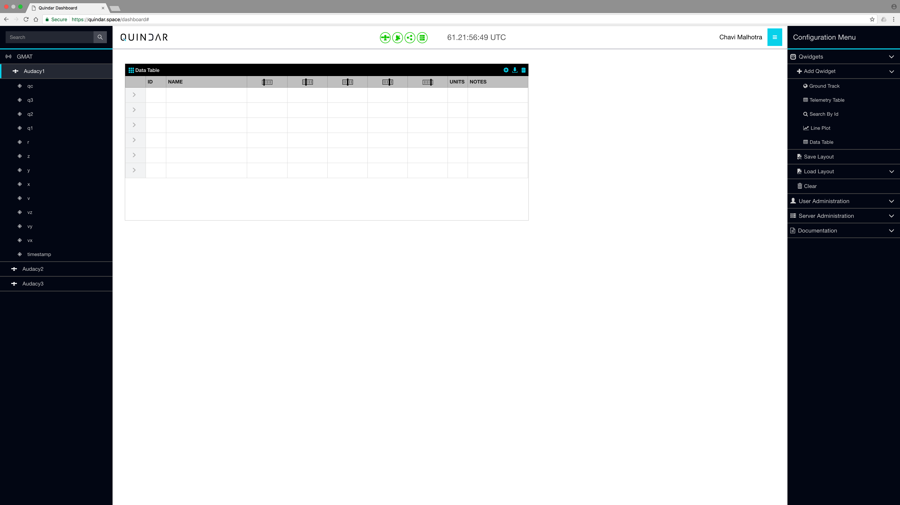
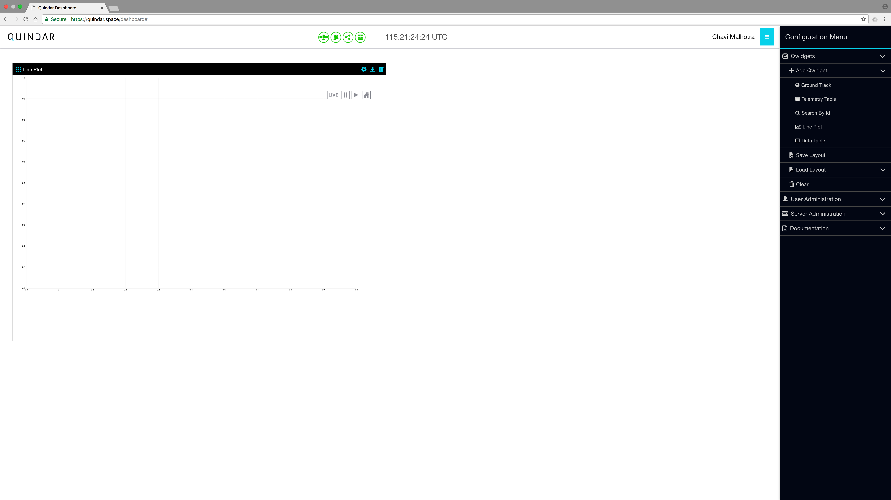
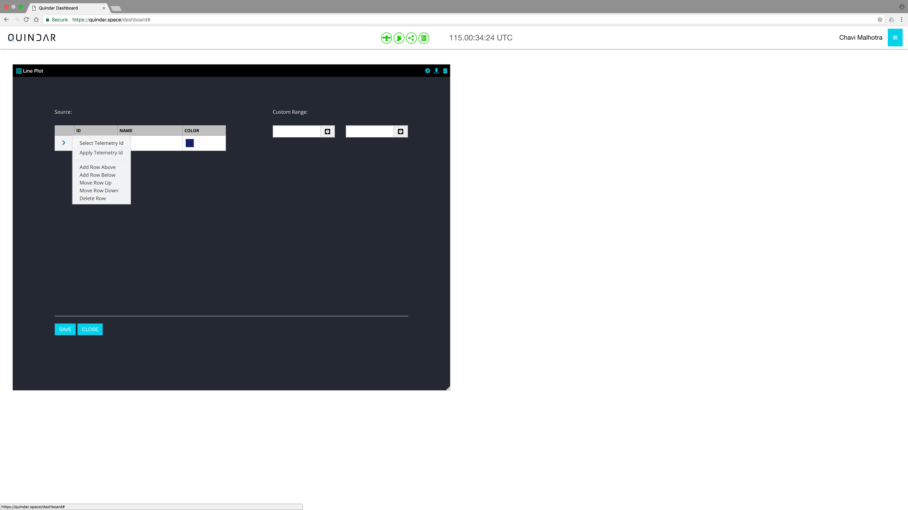
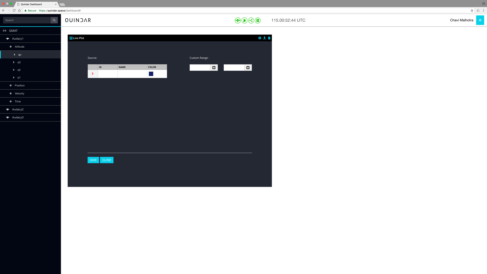
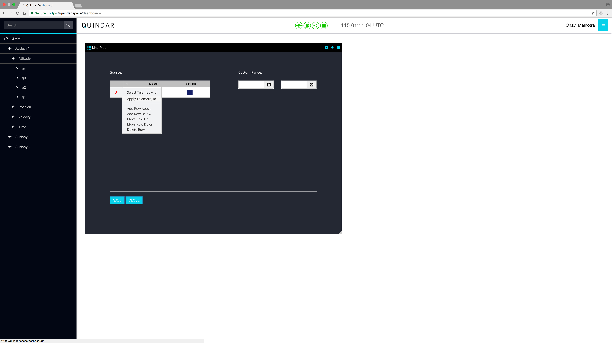
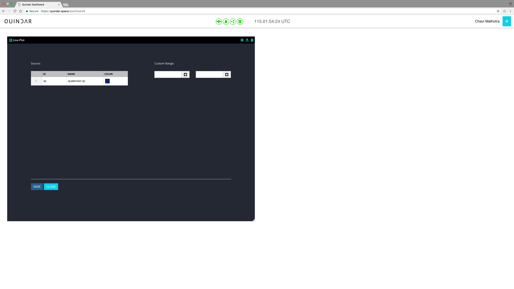
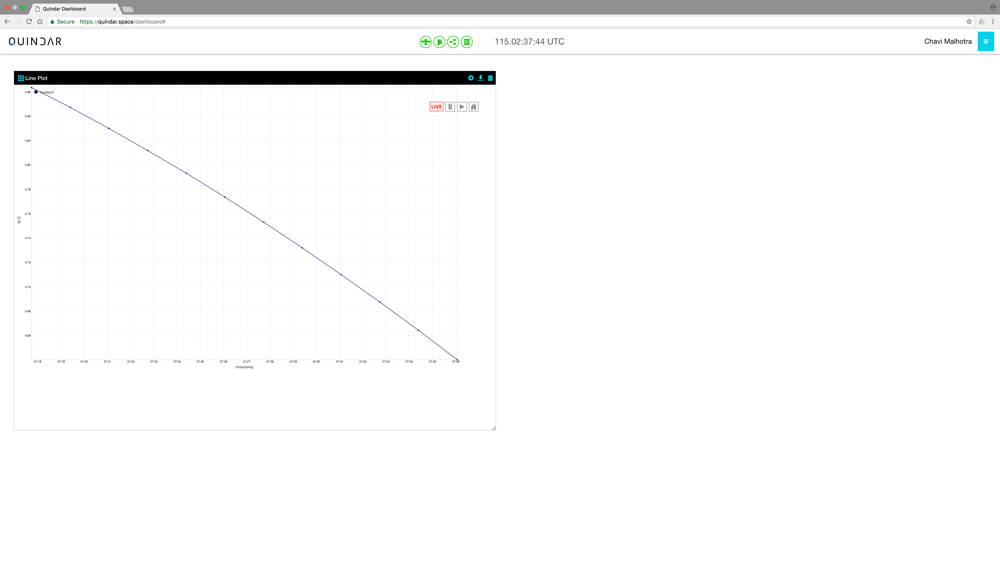

# Navigate Around Quindar

This guide covers the basics of using Quindar application.

## Quindar Application
Quindar essentially has two pages:
1. Login Page - A user can sign in with his/her Google account into the application.

2. Dashboard Page - This is the main dashboard containing Quindar widgets (Qwidgets) configured as per the user. A user can add widgets to the layout grid, drag the widgets around, delete widgets, clear the grid layout and much more. In the screenshot below, there is a single Data Table widget on the dashboard.

The dashboard page contains two sidebars(left and right), which are default closed.
1. Data Menu(Left Sidebar) - This menu contains the data source (satellites) and related telemetry data to be plotted in the widgets. This menu can be toggled using the ‘Quindar’ brand name on the top left.
2. Configuration Menu - This menu gives the ability to configure the dashboard as per the user by laying out different widgets. This menu can be toggled using the hamburger icon on the top right.

## Steps to add a widget in Quindar (Line Plot Qwidget)
1. Open the “Configuration Menu” and click on Line Plot. A layout for the Qwidget will appear on the dashboard.

2. To plot data on the Line Plot Qwidget, click on the “gear icon” (Settings Menu).

3. To select data, click on the arrow on the table and then click "Select Telemetry Id".

4. The Data Menu opens. Select the telemetry data point to be plotted. In this case, qc.

5. Click on the arrow in Line Plot widget again and then click "Apply Telemetry Id".

6. The telemetry data point is populated in the table. Click on Save to close the menu.

7. Click on “PLAY” button on top right corner. Line Plot Qwidget with plotted data updating every second appears.

