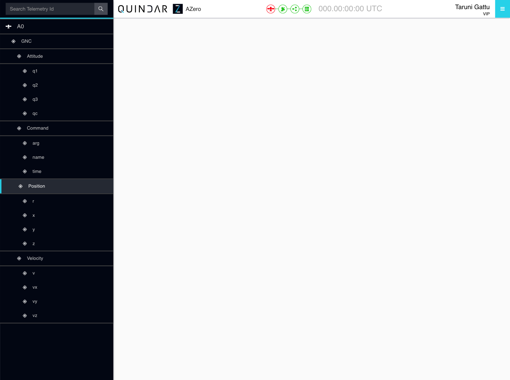
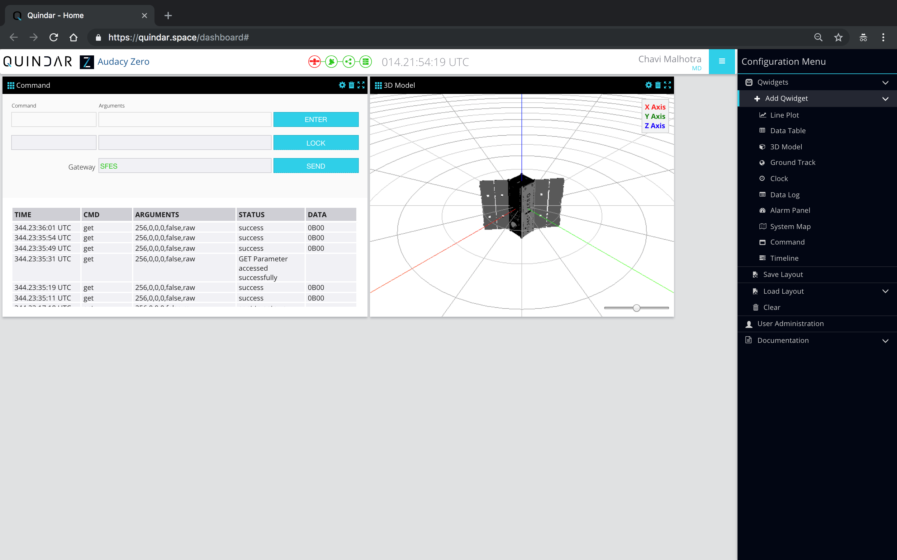

# Navigate Around Quindar

This guide covers the basics of using Quindar application.

## Quindar Application
Quindar essentially has two pages:
1. Login Page - A user can sign in with his/her Google account into the application.

2. Dashboard Page - This is the main dashboard containing Quindar widgets (Qwidgets) configured as per the user. A user can add widgets to the layout grid, drag the widgets around, delete widgets, clear the grid layout and much more. 

The dashboard page contains two sidebars(left and right), which are default closed.
1. Data Menu(Left Sidebar) - This menu contains the data source (satellites) and related telemetry data to be plotted in the widgets. This menu can be toggled using the ‘Quindar’ brand name on the top left. The following are the main elements in the data menu.
    * Search bar - It is used to search the data tree for a telemetry data id. On successful search, the tree displays the searched item.
    * Data Tree - Data tree is a hierarchical display of telemetry data points, organized into different systems and sub systems.The top most or the first element in the hierarchy is the platform name. This data menu is used by Qwidgets to select data.

2. Configuration Menu - This menu gives the ability to configure the dashboard as per the user by laying out different widgets. This menu can be toggled using the hamburger icon on the top right. The following are the main elements in the configuration menu.
    * Qwidgets - Using this menu and its sub menu, user can add Qwidgets to the dashboard, save the grid layout, load a previous layout and also clear the grid.
    * User Administration - Using this menu, the admin can assign roles and permissions to other users of the application.
    * Documentation - This contains the Github README and Contributing files as pop up windows.

